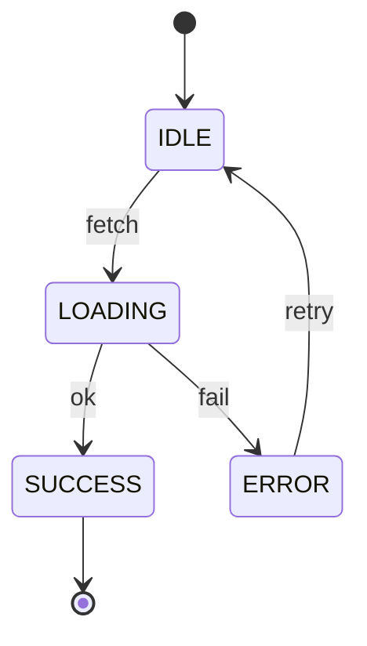

# Example UI Spec (Condensed)

> Example only. Replace with project-specific content.

## 0) UI Summary

Dashboard UI optimized for clarity and low cognitive load.  
Evidence: UX spec section 2.

## 1) Design Tokens (aStudio)

### Color
- Tokens used: `color.background.light.primary`, `color.text.light.primary`  
Evidence: `packages/tokens/src/tokens/index.dtcg.json`

### Typography
- Font families: `--font-sans`  
- Type scale: `type.body`, `type.heading`  
Evidence: `packages/tokens/src/typography.ts`

### Typography Scale Mapping
| Token | Usage | Size/Line-height | Weight |
| --- | --- | --- | --- |
| type.heading | Page title | 24/32 | 600 |
| type.body | Body text | 14/20 | 400 |
Evidence: `packages/tokens/src/typography.ts`

### Spacing & Layout
- Spacing scale: `s8`, `s16`, `s24`  
- Grid: 12‑col, 24px gutters  
Evidence: `packages/tokens/src/spacing.ts`

### Radii & Shadows
- Radius tokens: `r8`  
- Shadow tokens: `shadow.sm`  
Evidence: `packages/tokens/src/radius.ts`, `packages/tokens/src/shadows.ts`

### Iconography
- Icon set: `@astudio/astudio-icons`  
Evidence: `packages/astudio-icons/src/registry.ts`

### Icon Usage Rules
- Sizing and alignment: `s16`, `s24`, align to text baseline  
- Stroke/weight constraints: 1.5px  
- Color tokens allowed: `color.icon.light.primary`  
- Do not use: custom SVGs without registry entry  
Evidence: `packages/astudio-icons/src/Icon.tsx`

### Brand Guidelines
- Logo usage: top-left only  
- Brand mark usage: no stretching  
Evidence: `brand/`

## 2) Layout & Composition

- Page/surface structure: single primary column + right panel  
- Component hierarchy: Header → Filters → Content Grid  
Evidence: UX spec section 4.

## 2.1 Component Registry Check

- Components used: `Card`, `Button`, `SectionHeader` (`@astudio/ui`)  
- Gaps / proposed additions: None  
Evidence: `packages/ui/README.md`

## 3) Components

### Filter Bar

- Purpose: quick filtering  
- Token references: spacing `s16`, radius `r8`  
- Size/spacing: height `s40`  
- Interactive states: hover/focus  
Evidence: UX spec section 3.

## 4) States & Feedback

- Loading: skeleton cards  
- Empty: “No results” message  
- Error: retry action  
Evidence: UX spec section 5.

## 5) Accessibility UI Rules

- Color contrast assumptions: AA  
- Focus styles: visible ring  
- Motion preferences: reduced motion respected  
Evidence: `docs/guides/DESIGN_GUIDELINES.md`

## 5.1 Design Guidelines Checklist (aStudio)

- Apps SDK UI first; prefer `@astudio/ui` wrappers.  
- Avoid raw tokens in production UI code.  
- Use icon adapter; provide accessible labels for icon-only controls.  
Evidence: `docs/guides/DESIGN_GUIDELINES.md`

## 5.2 Gold UI Standard Checklist (Jan 2026)

- WCAG 2.2 AA, keyboard access, visible focus, icon labels, contrast checked.  
- 4px spacing scale with documented exceptions only.  
Evidence: UX spec + aStudio tokens.

## 6) State Machine Diagrams

Evidence: UX spec section 5.

## Evidence Gaps

- None

## Evidence Map

| Claim/Section | Evidence | Notes |
| --- | --- | --- |
| Tokens | aStudio token files |  |
