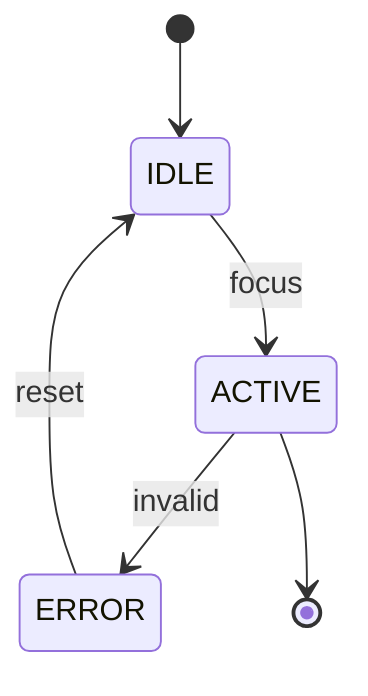

# UI Spec Template (aStudio-aligned)

> Every section ends with `Evidence:` or `Evidence gap:`.
> Use aStudio tokens; do not invent values.

## 0) UI Summary

One-sentence UI intent.  
Evidence:

## 1) Design Tokens (aStudio)

### Color
- Tokens used:
Evidence:

### Typography
- Font families:
- Type scale:
Evidence:

### Typography Scale Mapping
| Token | Usage | Size/Line-height | Weight |
| --- | --- | --- | --- |
| | | | |
Evidence:

### Spacing & Layout
- Spacing scale:
- Grid:
Evidence:

### Radii & Shadows
- Radius tokens:
- Shadow tokens:
Evidence:

### Iconography
- Icon set + usage rules:
Evidence:

### Icon Usage Rules
- Sizing and alignment:
- Stroke/weight constraints:
- Color tokens allowed:
- Do not use:
Evidence:

### Brand Guidelines
- Logo usage:
- Brand mark usage:
Evidence:

## 2) Layout & Composition

- Page/surface structure:
- Component hierarchy:
Evidence:

## 2.1 Component Registry Check

- Components used and source (`@astudio/ui` or Apps SDK UI):
- Gaps / proposed additions:
Evidence:

## 3) Components (specify each)

### <Component Name>

- Purpose:
- Token references:
- Size/spacing:
- Interactive states:
Evidence:

## 4) States & Feedback

- Loading, empty, error, success states:
Evidence:

## 5) Accessibility UI Rules

- Color contrast assumptions:
- Focus styles:
- Motion preferences:
Evidence:

## 5.1 Design Guidelines Checklist (aStudio)

- Apps SDK UI first; prefer `@astudio/ui` wrappers.
- Avoid raw tokens in production UI code.
- No direct imports of `@radix-ui/*` outside primitives.
- Use icon adapter; provide accessible labels for icon-only controls.
Evidence:

## 5.2 Gold UI Standard Checklist (Jan 2026)

- WCAG 2.2 AA: keyboard access, visible focus, icon labels, contrast checked.
- 4px spacing scale with documented exceptions only.
- Typography uses aStudio scale and semantic hierarchy.
- Semantic color tokens only; no raw hex values.
- Motion respects reduced motion preferences; no motion-only meaning.
Evidence:

## 5.3 Contrast Targets

- Text: 4.5:1 (normal), 3:1 (large)
- UI controls: 3:1 minimum
Evidence:

## 5.4 Touch Targets

- Mobile: 44x44px minimum
- Desktop: 32x32px minimum
Evidence:

## 5.4.1 Hit-Area Spacing

- Minimum spacing between adjacent targets: 8px
Evidence:

## 5.5 Motion System

- Duration bands (micro/transition):
- Easing tokens:
- Reduced-motion fallback:
Evidence:

## 5.6 Density Modes

- Compact:
- Cozy:
- Comfortable:
Evidence:

## 5.6.1 Responsive Breakpoints

- Breakpoint tokens:
- Layout shifts per breakpoint:
Evidence:

## 5.6.2 Grid Sizes (Token-Based)

- Columns:
- Gutters:
- Margins:
Evidence:

## 5.7 Type Rhythm

- Baseline grid:
- Line-height rules:
- Orphan/widow rules:
Evidence:

## 5.8 Iconography Rules

- Grid size:
- Stroke weight:
- Alignment baseline:
- Naming conventions:
Evidence:

## 6) State Machine Diagrams (per component)

Evidence:

## Evidence Gaps

- ...

## Evidence Map

| Claim/Section | Evidence | Notes |
| --- | --- | --- |
| | | |
