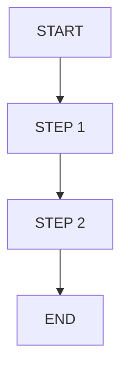
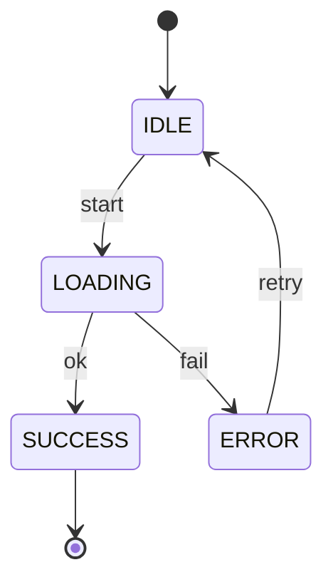

# Mermaid Examples (Minimal)

## Flowchart

```mermaid
flowchart TD
  A[START] --> B[STEP 1]
  B --> C[STEP 2]
  C --> D[END]
```

## State Machine

```mermaid
stateDiagram-v2
  [*] --> IDLE
  IDLE --> LOADING: start
  LOADING --> SUCCESS: ok
  LOADING --> ERROR: fail
  ERROR --> IDLE: retry
  SUCCESS --> [*]
```
