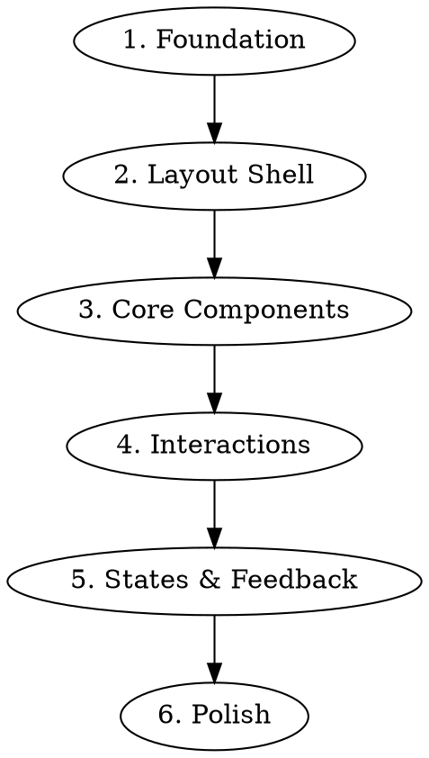

# UX Spec to Build-Order Prompts

## Overview

Transform detailed UX specifications into a sequence of self-contained prompts optimized for UI generation tools. Each prompt builds one discrete feature/view with full context included.

## When to Use

- User has a UX spec, PRD, or detailed feature documentation
- Output needs to feed into UI generation tools (v0, Bolt, Claude, etc.)
- User wants build-order sequencing (foundations → features → polish)
- Large specs that would overwhelm a single prompt

**Not for:** Quick component requests, already-atomic features, specs that fit in one prompt.

## Core Pattern

```
UX Spec → Extract Atomic Units → Sequence by Dependencies → Generate Self-Contained Prompts
```

## Build Order Strategy

Generate prompts in this order:



| Phase | What to Include | Why First |
|-------|-----------------|-----------|
| **Foundation** | Design tokens, shared types, base styles | Everything depends on these |
| **Layout Shell** | Page structure, navigation, panels | Container for all features |
| **Core Components** | Primary UI elements (nodes, cards, inputs) | Building blocks for features |
| **Interactions** | Drag-drop, connections, pickers | Depend on components existing |
| **States & Feedback** | Empty, loading, error, success states | Refinement of existing elements |
| **Polish** | Animations, responsive, edge cases | Final layer |

## Prompt Structure Template

Each generated prompt follows this structure:

```markdown
## [Feature Name]

### Context
[What this feature is and where it fits in the app]

### Requirements
- [Specific behavior/appearance requirement]
- [Another requirement]
- [Include relevant specs: dimensions, colors, states]

### Hit-Area Rules
- Mobile min target: 44x44px
- Desktop min target: 32x32px
- Min spacing between adjacent targets: 8px

### Responsive & Grid
- Breakpoint tokens and layout shifts (tokenized)
- Grid sizes: columns, gutters, margins (token-based)

### States
- Default: [description]
- [Other states from spec]

### Interactions
- [How user interacts]
- [Keyboard support if applicable]

### Constraints
- [Technical or design constraints]
- [What NOT to include]
```

## Extraction Process

### Step 1: Identify Atomic Units

Read through the spec and list discrete buildable features:
- Each screen/view
- Each reusable component
- Each interaction pattern
- Each state variation

### Step 2: Map Dependencies

For each unit, note what it requires:
- "Node card requires design tokens"
- "Connection lines require nodes to exist"
- "Lens picker requires prompt field"

### Step 3: Sequence by Dependency Graph

Order units so dependencies come first. Group related items into single prompts when they're tightly coupled.

### Step 4: Write Self-Contained Prompts

For each prompt:
1. **Re-state relevant context** - Don't assume reader saw previous prompts
2. **Include specific measurements** - Extract from spec (dimensions, spacing)
3. **Include all states** - Pull from state design section
4. **Include interaction details** - Pull from affordances section
5. **Include hit-area + responsive rules** - Pull min target sizes, spacing, breakpoints, and grid sizes
6. **Set boundaries** - What this prompt does NOT include

## Self-Containment Rules

Each prompt MUST include:
- Enough context to understand the feature in isolation
- All visual specs (colors, spacing, dimensions) relevant to that feature
- All states that feature can be in
- All interactions for that feature
- Hit-area rules and responsive/grid specs relevant to that feature

Each prompt MUST NOT:
- Reference "see previous prompt" or "as described earlier"
- Assume knowledge from other prompts
- Leave specs vague ("appropriate styling")

## Example Transformation

**From UX Spec:**
```
#### Node Card (Sidebar)
- Dimensions: ~200px width, ~48px height
- Content: Icon (left), Name (center/left), Preview badge (right, if applicable)
- States: Default, Hover (subtle highlight), Dragging (ghost follows cursor)
```

**To Prompt:**
```markdown
## Sidebar Node Card Component

### Context
A draggable card in the workflow builder sidebar representing a node type
users can add to the canvas. Part of a node palette with "Triggers" and
"Actions" sections.

### Requirements
- Width: 200px, Height: 48px
- Layout: Icon on left, node name center-left, optional "Preview" badge on right
- Background: Neutral/card background color
- Border-radius: 8px (standard card radius)

### States
- Default: Standard card appearance
- Hover: Subtle background highlight, cursor changes to grab
- Dragging: Semi-transparent ghost follows cursor, original card shows placeholder

### Interactions
- Click: Could select or auto-place on canvas
- Drag: Initiates drag-drop to canvas
- Drag end on canvas: Creates node at drop position
- Drag end outside canvas: Cancels, no node created

### Constraints
- Component only - not the full sidebar
- Do not implement actual drag-drop logic, just visual states
- Placeholder nodes show muted styling + "Preview" badge
```

## Output Format

Generate a markdown document with:

```markdown
# Build-Order Prompts: [Project Name]

## Overview
[1-2 sentence summary of what's being built]

## Build Sequence
1. [Prompt name] - [brief description]
2. [Prompt name] - [brief description]
...

---

## Prompt 1: [Feature Name]
[Full self-contained prompt]

---

## Prompt 2: [Feature Name]
[Full self-contained prompt]

...
```

## Quality Checklist

Before finalizing prompts:

- [ ] Every measurement from spec is captured in a prompt
- [ ] Every state from spec is captured in a prompt
- [ ] Every interaction from spec is captured in a prompt
- [ ] Hit-area rules and responsive/grid specs are captured where relevant
- [ ] No prompt references another prompt
- [ ] Build order respects dependencies
- [ ] Each prompt could be given to someone with no context

## Common Mistakes

| Mistake | Fix |
|---------|-----|
| Prompts too large (whole spec in one) | Break into atomic features |
| Prompts reference each other | Re-state needed context inline |
| Missing states | Cross-reference spec's state design section |
| Vague measurements ("good spacing") | Use exact values from spec |
| Wrong build order | Check dependency graph |
| Duplicated component definitions | Each component defined once, in first prompt that needs it |

## References
- `references/contract.yaml`
- `references/evals.yaml`

## When to use
- Use when translating UX specs or PRDs into build-order prompts for UI generators.
- Avoid for single, atomic components that fit in one prompt.

## Inputs
- UX spec or PRD file path.
- Optional: target tool (v0, Bolt, Claude, etc.).

## Outputs
- Build-order prompt document with self-contained prompts.
- Include `schema_version: 1` if outputs are contract-bound.

## Constraints
- Redact secrets/PII by default.
- Do not reference other prompts; each prompt must be self-contained.

## Validation
- Ensure all measurements, states, and interactions from the spec are captured.
- Verify dependency ordering is respected.
- Fail fast on missing context or vague specs.

## Philosophy
- Self-contained prompts reduce ambiguity and rework.
- Build order prevents dependency dead-ends.
- Principle: each prompt should stand alone as a complete, testable unit of intent.
- Framework: context + requirements + states + interactions + constraints = buildable prompt.

## Variation
- Vary prompt granularity based on spec size and tool limits.
- Expand state and interaction detail for high-risk flows.
- Avoid generic patterns; adapt prompts to domain (dashboard vs compact screens vs editor) and user sophistication.
- If the spec is thin, bias toward asking for missing measurements rather than guessing.

## Empowerment
- You are empowered to refuse vague specs and request concrete measurements.

## Anti-patterns
- Splitting by screens without shared foundations.
- Leaving measurements vague or implied.
- Assuming prior context from earlier prompts.
- NEVER reference other prompts (no “as above”).
- DO NOT skip hit-area or responsive/grid rules when the spec includes them.

## Examples
- "Generate build-order prompts from this UX spec for v0."

## Remember
The agent is capable of extraordinary work in this domain. These guidelines unlock that potential—they don't constrain it.
Use judgment, adapt to context, and push boundaries when appropriate.
