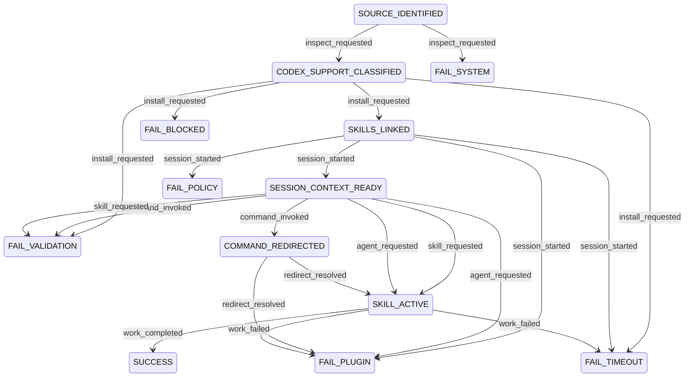

# Superpowers Operational Spec

## Table of Contents
- [Scope](#scope)
- [Operational Mode](#operational-mode)
- [Plugin Contract](#plugin-contract)
- [Metadata](#metadata)
- [Plugin Registry](#plugin-registry)
- [Capability Map](#capability-map)
- [Idempotency](#idempotency)
- [Invariants](#invariants)
- [Transition Table](#transition-table)
- [Diagram](#diagram)
- [Dry-Run Simulation](#dry-run-simulation)
- [Transition Tracing](#transition-tracing)
- [Logs](#logs)

## Scope
This spec models the observed `superpowers` behavior for Codex-oriented use based on the source repo's current multi-platform layout:
- Codex support is documented through native skill discovery and symlink installation.
- `skills/` is the primary runtime surface.
- `commands/` contains deprecated redirect shims.
- `hooks/session-start` injects startup context and uses provider-specific output branching in the source implementation.

Assumption:
- this spec models the runtime and installation behavior of `superpowers` as used from Codex, not the conversion workflow of `codex-plugin-builder`.

## Operational Mode
- `STRICT`: fail on missing native Codex prerequisites, invalid skill surface, or unsupported hook adaptation.
- `ADVISORY`: allow inspection and dry-run tracing to continue through non-fatal warnings, but do not mark runtime execution as `SUCCESS` unless invariants hold.

## Plugin Contract
```yaml
plugin_id: superpowers
capabilities:
  - codex_native_install_detect
  - codex_skill_link
  - session_context_inject
  - deprecated_command_redirect
  - skill_dispatch
  - agent_dispatch
result_status:
  - SUCCESS
  - FAILURE
  - RETRYABLE
errors:
  - VALIDATION_ERROR
  - BLOCKED_DEPENDENCY
  - POLICY_FAIL
  - SYSTEM_ERROR
  - PLUGIN_TIMEOUT
  - PLUGIN_FAILURE
```

## Metadata
```yaml
metadata:
  owner: obra
  max_duration: "session_start <= 5s, skill_dispatch <= user-driven"
  escalation: "escalate when Codex-native install is absent, skill surface is invalid, or hook adaptation requires provider-specific behavior not supported in Codex"
  plugin_scope:
    - native_codex_skill_install
    - startup_context_injection
    - skill_first_workflow_routing
    - deprecated_command_redirection
```

## Plugin Registry
```yaml
plugin_registry:
  superpowers:
    plugin_id: superpowers
    capabilities:
      - codex_native_install_detect
      - codex_skill_link
      - session_context_inject
      - deprecated_command_redirect
      - skill_dispatch
      - agent_dispatch
```

## Capability Map
```yaml
capability_map:
  codex_native_install_detect:
    plugin_id: superpowers
    description: "Check for native Codex install docs and skill-discovery lane."
  codex_skill_link:
    plugin_id: superpowers
    description: "Link or verify the superpowers skills path for Codex discovery."
  session_context_inject:
    plugin_id: superpowers
    description: "Inject startup context equivalent to the using-superpowers skill on session start."
  deprecated_command_redirect:
    plugin_id: superpowers
    description: "Redirect deprecated command shims to canonical skills."
  skill_dispatch:
    plugin_id: superpowers
    description: "Dispatch a skill from the superpowers skills surface."
  agent_dispatch:
    plugin_id: superpowers
    description: "Dispatch an optional agent surface when present and supported."
```

## Idempotency
- `codex_native_install_detect` is idempotent: repeated inspection returns the same classification for unchanged source state.
- `codex_skill_link` is idempotent when the target symlink or equivalent discovery path already resolves to the same `skills/` directory.
- `session_context_inject` is idempotent per session-start event: repeated identical injections in the same session must not create divergent state.
- `deprecated_command_redirect` is idempotent: repeated redirects resolve to the same canonical skill target.
- `skill_dispatch` and `agent_dispatch` are not globally idempotent because they depend on user task context, but transition selection must remain deterministic for the same `(state,event,guard)` tuple.

## Invariants
- `skills/` is the canonical runtime surface.
- deprecated command files must never outrank their canonical skill targets.
- failure states are terminal.
- success state is terminal.
- every plugin capability invocation must reference `superpowers` in `plugin_registry`.
- `SUCCESS` is valid only if Codex-native install is verified and skill routing resolves to a concrete skill or agent capability.
- provider-specific hook glue from the source implementation must not be copied verbatim into Codex runtime behavior; only hook intent is portable.

## Transition Table
Transition table is the source of truth.

| S | E | G | A | P | R | N |
| --- | --- | --- | --- | --- | --- | --- |
| SOURCE_IDENTIFIED | inspect_requested | source repo reachable and mode in {STRICT, ADVISORY} | inspect Codex support surfaces | `superpowers.codex_native_install_detect` | SUCCESS | CODEX_SUPPORT_CLASSIFIED |
| SOURCE_IDENTIFIED | inspect_requested | source repo unreachable | record inspection failure | `superpowers.codex_native_install_detect` | FAILURE:SYSTEM_ERROR | FAIL_SYSTEM |
| CODEX_SUPPORT_CLASSIFIED | install_requested | native Codex docs present and `skills/` exists | verify or create Codex skill link | `superpowers.codex_skill_link` | SUCCESS | SKILLS_LINKED |
| CODEX_SUPPORT_CLASSIFIED | install_requested | native Codex docs missing or `skills/` missing | block installation | `superpowers.codex_skill_link` | FAILURE:VALIDATION_ERROR | FAIL_VALIDATION |
| CODEX_SUPPORT_CLASSIFIED | install_requested | filesystem write or symlink dependency unavailable | report blocked install dependency | `superpowers.codex_skill_link` | FAILURE:BLOCKED_DEPENDENCY | FAIL_BLOCKED |
| CODEX_SUPPORT_CLASSIFIED | install_requested | install action exceeds allowed duration | record retryable install timeout | `superpowers.codex_skill_link` | RETRYABLE:PLUGIN_TIMEOUT | FAIL_TIMEOUT |
| SKILLS_LINKED | session_started | startup context hook supported | inject using-superpowers startup context | `superpowers.session_context_inject` | SUCCESS | SESSION_CONTEXT_READY |
| SKILLS_LINKED | session_started | startup hook adaptation violates policy or requires unsupported provider-specific glue in STRICT mode | reject hook activation | `superpowers.session_context_inject` | FAILURE:POLICY_FAIL | FAIL_POLICY |
| SKILLS_LINKED | session_started | hook execution fails | record hook runtime failure | `superpowers.session_context_inject` | FAILURE:PLUGIN_FAILURE | FAIL_PLUGIN |
| SKILLS_LINKED | session_started | hook execution exceeds allowed duration | record retryable hook timeout | `superpowers.session_context_inject` | RETRYABLE:PLUGIN_TIMEOUT | FAIL_TIMEOUT |
| SESSION_CONTEXT_READY | command_invoked | command file is deprecated redirect shim and canonical skill target exists | redirect to canonical skill | `superpowers.deprecated_command_redirect` | SUCCESS | COMMAND_REDIRECTED |
| SESSION_CONTEXT_READY | command_invoked | command file exists but redirect target is missing | fail redirect validation | `superpowers.deprecated_command_redirect` | FAILURE:VALIDATION_ERROR | FAIL_VALIDATION |
| SESSION_CONTEXT_READY | skill_requested | requested skill exists | dispatch requested skill | `superpowers.skill_dispatch` | SUCCESS | SKILL_ACTIVE |
| SESSION_CONTEXT_READY | skill_requested | requested skill missing | fail skill lookup | `superpowers.skill_dispatch` | FAILURE:VALIDATION_ERROR | FAIL_VALIDATION |
| SESSION_CONTEXT_READY | agent_requested | requested agent exists and runtime supports agents | dispatch requested agent | `superpowers.agent_dispatch` | SUCCESS | SKILL_ACTIVE |
| SESSION_CONTEXT_READY | agent_requested | requested agent missing or runtime does not support agents | fail agent lookup | `superpowers.agent_dispatch` | FAILURE:PLUGIN_FAILURE | FAIL_PLUGIN |
| COMMAND_REDIRECTED | redirect_resolved | canonical skill target exists | dispatch redirected skill | `superpowers.skill_dispatch` | SUCCESS | SKILL_ACTIVE |
| COMMAND_REDIRECTED | redirect_resolved | canonical skill dispatch fails | record redirected skill failure | `superpowers.skill_dispatch` | FAILURE:PLUGIN_FAILURE | FAIL_PLUGIN |
| SKILL_ACTIVE | work_completed | skill or agent work completed without plugin error | finalize workflow result | `superpowers.skill_dispatch` | SUCCESS | SUCCESS |
| SKILL_ACTIVE | work_failed | capability returns non-retryable plugin failure | record runtime plugin failure | `superpowers.skill_dispatch` | FAILURE:PLUGIN_FAILURE | FAIL_PLUGIN |
| SKILL_ACTIVE | work_failed | capability times out | record retryable runtime timeout | `superpowers.skill_dispatch` | RETRYABLE:PLUGIN_TIMEOUT | FAIL_TIMEOUT |

## Diagram


## Dry-Run Simulation
Dry-run must execute transition evaluation without mutating runtime installation state.

Simulation contract:
```yaml
dry_run:
  enabled: true
  effects:
    - evaluate guards
    - emit chosen transition
    - emit projected plugin capability calls
    - do not create symlinks
    - do not modify runtime hook files
    - do not persist session context
```

Dry-run algorithm:
```text
1. Start with input state S and event E.
2. Filter transition table rows where S and E match exactly.
3. Evaluate guards in row order until exactly one guard resolves true.
4. Emit A, P, R, and N as the simulated transition.
5. If no guard resolves true, return FAILURE:VALIDATION_ERROR and transition to FAIL_VALIDATION.
6. If more than one guard resolves true, treat the table as invalid and return FAILURE:SYSTEM_ERROR to FAIL_SYSTEM.
```

## Transition Tracing
Trace output must be generated from the transition table only.

Trace contract:
```yaml
transition_trace:
  enabled: true
  fields:
    - workflow_id
    - plugin_id
    - capability
    - transition_code
    - from_state
    - to_state
    - correlation_id
    - result
```

Transition code format:
- `TC::<from_state>::<event>::<to_state>`

## Logs
```yaml
logs:
  workflow_id: "<uuid>"
  plugin_id: "superpowers"
  capability: "<capability name>"
  transition_code: "TC::<from_state>::<event>::<to_state>"
  from_state: "<state>"
  to_state: "<state>"
  correlation_id: "<trace or request id>"
  result: "SUCCESS | FAILURE:<error> | RETRYABLE:<error>"
```
