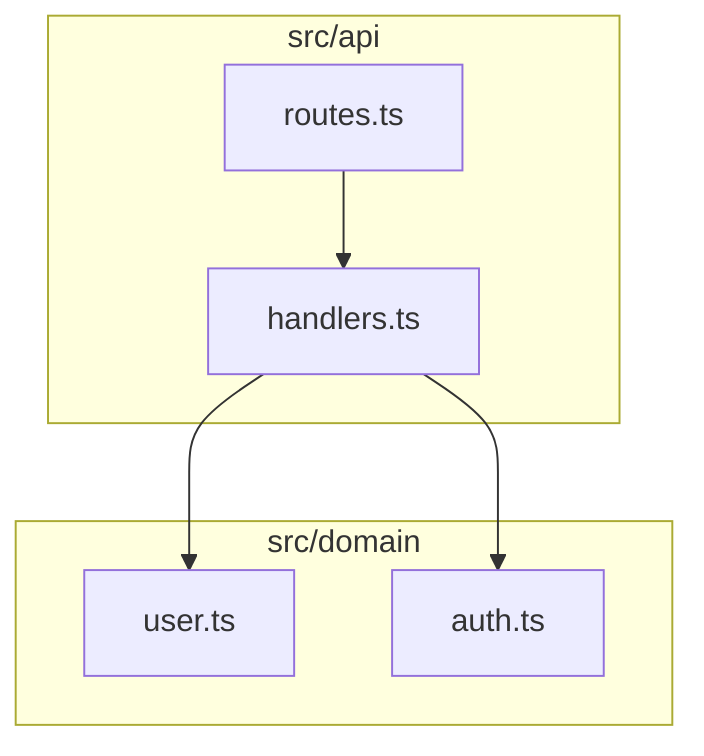

# Output Formats

## Mermaid (.mmd)

Primary output format - textual diagram definition.

```bash
diagram generate . --output diagram.mmd
```

**Advantages:**
- Human-readable text
- Version control friendly
- AI-agent consumable
- Renders in GitHub, GitLab, IDEs with Mermaid support

**Example:**


---

## SVG (.svg)

Vector image format for documentation and presentations.

```bash
diagram generate . --output diagram.svg
```

**Prerequisites:**
```bash
npm install -g @mermaid-js/mermaid-cli
```

**Advantages:**
- Scalable without quality loss
- Embeddable in documentation
- Styleable with CSS
- Searchable text

---

## PNG (.png)

Raster image format for quick previews.

```bash
diagram generate . --output diagram.png
```

**Prerequisites:**
```bash
npm install -g @mermaid-js/mermaid-cli
```

---

## JSON Output

Structured data output for tooling integration.

```bash
# Analysis output
diagram analyze . --json

# Test results
diagram test --format json

# PR impact report
diagram workflow pr . --json
```

**Use Cases:**
- CI/CD pipeline integration
- Custom tooling consumption
- Dashboard/metrics collection

---

## JUnit XML

Standard test result format for CI reporters.

```bash
diagram test --format junit --output architecture-results.xml
```

**CI Integration:**
```yaml
- uses: dorny/test-reporter@v1
  if: success() || failure()
  with:
    name: Architecture Tests
    path: .diagram/architecture-results.xml
    reporter: java-junit
```

---

## HTML Explainer

Human-readable PR impact report.

```bash
diagram workflow pr .  # Generates pr-impact.html
```

**Contents:**
- Summary of changes
- Risk level with breakdown
- Blast radius visualization
- Affected components list
- Recommendations

---

## Video (.mp4, .webm, .mov)

Animated video output for presentations.

```bash
diagram video . --output architecture.mp4
```

**Prerequisites:**
```bash
npm install
npx playwright install chromium
brew install ffmpeg
```

**Options:**
- `--duration <sec>` - Video length (default: 5)
- `--fps <n>` - Frame rate (default: 30)
- `--width <n>` - Width in pixels (default: 1280)
- `--height <n>` - Height in pixels (default: 720)

---

## Animated SVG

CSS-animated SVG for web embedding.

```bash
diagram animate . --output diagram-animated.svg
```

**Prerequisites:**
```bash
npm install
npx playwright install chromium
```

---

## Manifest (manifest.json)

Machine-readable artifact index.

```bash
diagram all . --output-dir .diagram
# Creates .diagram/manifest.json
```

**Structure:**
```json
{
  "version": "1.0",
  "generated": "2026-03-02T12:00:00Z",
  "diagrams": [
    {
      "type": "architecture",
      "file": "architecture.mmd",
      "placeholder": false,
      "components": 15,
      "edges": 23
    }
  ]
}
```

**Validation:**
```bash
diagram manifest . --require-types architecture,security --fail-on-placeholder
```

---

## CI Artifact Directory

Standard output directory for CI: `.diagram/`

```
.diagram/
├── manifest.json           # Diagram index
├── architecture.mmd        # Architecture diagram
├── dependency.mmd          # Dependency diagram
├── security.mmd            # Security diagram
├── architecture-results.xml # Test results (JUnit)
└── pr-impact/              # PR analysis (if applicable)
    ├── pr-impact.json
    └── pr-impact.html
```

**Upload to CI:**
```yaml
- uses: actions/upload-artifact@v4
  with:
    name: diagram-ci-artifacts
    path: .diagram
```
