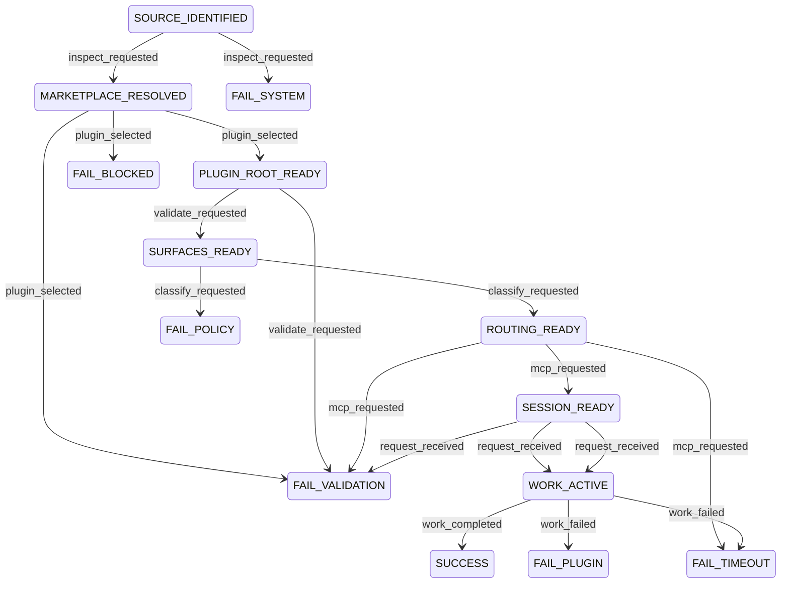

# Compound Engineering Operational Spec

## Table of Contents
- [Scope](#scope)
- [Operational Mode](#operational-mode)
- [Plugin Contract](#plugin-contract)
- [Metadata](#metadata)
- [Plugin Registry](#plugin-registry)
- [Capability Map](#capability-map)
- [Idempotency](#idempotency)
- [Invariants](#invariants)
- [Transition Table](#transition-table)
- [Diagram](#diagram)
- [Dry-Run Simulation](#dry-run-simulation)
- [Transition Tracing](#transition-tracing)
- [Logs](#logs)

## Scope
This spec models the Codex-oriented conversion and packaged runtime behavior for the `compound-engineering` plugin within the marketplace-style source repo:
- marketplace root and plugin root must be resolved separately;
- provider-specific manifests are migration references, not Codex runtime surfaces;
- command-like content may resolve to `skills/`, `prompts/`, or both;
- inline MCP and file-based MCP configuration must be reconciled before runtime use.

## Operational Mode
- `STRICT`: fail on unresolved plugin root, custom path traversal, MCP drift, or ambiguous command classification.
- `ADVISORY`: allow source inspection and dry-run tracing, but do not report `SUCCESS` unless plugin root, surfaces, and MCP shape are resolved cleanly.

## Plugin Contract
```yaml
plugin_id: compound-engineering
capabilities:
  - marketplace_resolve
  - plugin_root_select
  - surface_validate
  - command_classify
  - mcp_reconcile
  - skill_dispatch
  - prompt_dispatch
  - agent_dispatch
result_status:
  - SUCCESS
  - FAILURE
  - RETRYABLE
errors:
  - VALIDATION_ERROR
  - BLOCKED_DEPENDENCY
  - POLICY_FAIL
  - SYSTEM_ERROR
  - PLUGIN_TIMEOUT
  - PLUGIN_FAILURE
```

## Metadata
```yaml
metadata:
  owner: EveryInc
  max_duration: "inspection <= 30s, runtime dispatch <= user-driven"
  escalation: "escalate when marketplace root cannot be resolved, custom paths escape plugin root, or inline and file-based MCP definitions drift"
  plugin_scope:
    - marketplace_root_resolution
    - plugin_root_validation
    - semantic_command_classification
    - mcp_reconciliation
    - skill_prompt_agent_dispatch
```

## Plugin Registry
```yaml
plugin_registry:
  compound-engineering:
    plugin_id: compound-engineering
    capabilities:
      - marketplace_resolve
      - plugin_root_select
      - surface_validate
      - command_classify
      - mcp_reconcile
      - skill_dispatch
      - prompt_dispatch
      - agent_dispatch
```

## Capability Map
```yaml
capability_map:
  marketplace_resolve:
    plugin_id: compound-engineering
    description: "Resolve marketplace root versus plugin payload root."
  plugin_root_select:
    plugin_id: compound-engineering
    description: "Select the target plugin root from a source repo that may contain multiple plugins."
  surface_validate:
    plugin_id: compound-engineering
    description: "Validate manifest-declared custom paths and owned plugin surfaces."
  command_classify:
    plugin_id: compound-engineering
    description: "Classify command-like content into Codex skills, prompts, or both."
  mcp_reconcile:
    plugin_id: compound-engineering
    description: "Reconcile inline MCP definitions with file-based MCP config."
  skill_dispatch:
    plugin_id: compound-engineering
    description: "Dispatch a classified skill surface."
  prompt_dispatch:
    plugin_id: compound-engineering
    description: "Dispatch a classified prompt surface."
  agent_dispatch:
    plugin_id: compound-engineering
    description: "Dispatch an optional agent surface."
```

## Idempotency
- `marketplace_resolve`, `plugin_root_select`, and `surface_validate` are idempotent for unchanged source state.
- `mcp_reconcile` is idempotent when inline and file-based MCP definitions are unchanged.
- `command_classify` is deterministic for the same source tree and mapping rules.
- dispatch transitions are deterministic for the same `(S,E,G)` tuple.

## Invariants
- marketplace root and selected plugin root must not be conflated.
- custom paths must remain within the selected plugin root.
- provider-specific manifests remain migration references, not Codex runtime surfaces.
- inline MCP and file-based MCP config must not drift silently.
- failure states are terminal.
- success state is terminal.
- every plugin capability invocation must reference `compound-engineering` in `plugin_registry`.

## Transition Table
Transition table is the source of truth.

| S | E | G | A | P | R | N |
| --- | --- | --- | --- | --- | --- | --- |
| SOURCE_IDENTIFIED | inspect_requested | marketplace repo is reachable and manifests can be read | resolve marketplace root shape | `compound-engineering.marketplace_resolve` | SUCCESS | MARKETPLACE_RESOLVED |
| SOURCE_IDENTIFIED | inspect_requested | source repo unreachable or manifests unreadable | record inspection failure | `compound-engineering.marketplace_resolve` | FAILURE:SYSTEM_ERROR | FAIL_SYSTEM |
| MARKETPLACE_RESOLVED | plugin_selected | requested plugin root exists under marketplace and selection is unambiguous | select plugin payload root | `compound-engineering.plugin_root_select` | SUCCESS | PLUGIN_ROOT_READY |
| MARKETPLACE_RESOLVED | plugin_selected | plugin selection is ambiguous or target plugin root is missing | record plugin-root validation failure | `compound-engineering.plugin_root_select` | FAILURE:VALIDATION_ERROR | FAIL_VALIDATION |
| MARKETPLACE_RESOLVED | plugin_selected | selection depends on unavailable repo metadata or blocked local access | record blocked dependency | `compound-engineering.plugin_root_select` | FAILURE:BLOCKED_DEPENDENCY | FAIL_BLOCKED |
| PLUGIN_ROOT_READY | validate_requested | manifest-declared paths are valid and remain within plugin root | validate owned plugin surfaces | `compound-engineering.surface_validate` | SUCCESS | SURFACES_READY |
| PLUGIN_ROOT_READY | validate_requested | manifest-declared paths escape plugin root or required surfaces are missing | record surface validation failure | `compound-engineering.surface_validate` | FAILURE:VALIDATION_ERROR | FAIL_VALIDATION |
| SURFACES_READY | classify_requested | command-like content can be classified unambiguously into skill-owned runtime behavior (with optional `interface.defaultPrompt` entry text) | classify command surfaces semantically | `compound-engineering.command_classify` | SUCCESS | ROUTING_READY |
| SURFACES_READY | classify_requested | command-like content is ambiguous or conflicts with live tree semantics | record classification policy failure | `compound-engineering.command_classify` | FAILURE:POLICY_FAIL | FAIL_POLICY |
| ROUTING_READY | mcp_requested | inline and file-based MCP definitions agree or only one canonical source exists | reconcile MCP configuration | `compound-engineering.mcp_reconcile` | SUCCESS | SESSION_READY |
| ROUTING_READY | mcp_requested | MCP definitions drift or cannot be reconciled deterministically | record MCP validation failure | `compound-engineering.mcp_reconcile` | FAILURE:VALIDATION_ERROR | FAIL_VALIDATION |
| ROUTING_READY | mcp_requested | MCP reconciliation exceeds allowed duration | record retryable MCP timeout | `compound-engineering.mcp_reconcile` | RETRYABLE:PLUGIN_TIMEOUT | FAIL_TIMEOUT |
| SESSION_READY | request_received | request resolves uniquely to a classified skill surface | dispatch skill | `compound-engineering.skill_dispatch` | SUCCESS | WORK_ACTIVE |
| SESSION_READY | request_received | request resolves uniquely to an agent surface and runtime supports agents | dispatch agent | `compound-engineering.agent_dispatch` | SUCCESS | WORK_ACTIVE |
| SESSION_READY | request_received | request does not resolve to any enabled classified surface | record routing validation failure | `compound-engineering.command_classify` | FAILURE:VALIDATION_ERROR | FAIL_VALIDATION |
| WORK_ACTIVE | work_completed | active capability completed without plugin error and the originating dispatch was skill | finalize workflow result | `compound-engineering.skill_dispatch` | SUCCESS | SUCCESS |
| WORK_ACTIVE | work_completed | active capability completed without plugin error and the originating dispatch was agent | finalize workflow result | `compound-engineering.agent_dispatch` | SUCCESS | SUCCESS |
| WORK_ACTIVE | work_failed | active capability returned non-retryable plugin failure and the originating dispatch was skill | record runtime plugin failure | `compound-engineering.skill_dispatch` | FAILURE:PLUGIN_FAILURE | FAIL_PLUGIN |
| WORK_ACTIVE | work_failed | active capability returned non-retryable plugin failure and the originating dispatch was agent | record runtime plugin failure | `compound-engineering.agent_dispatch` | FAILURE:PLUGIN_FAILURE | FAIL_PLUGIN |
| WORK_ACTIVE | work_failed | active capability exceeded allowed duration and the originating dispatch was skill | record retryable runtime timeout | `compound-engineering.skill_dispatch` | RETRYABLE:PLUGIN_TIMEOUT | FAIL_TIMEOUT |
| WORK_ACTIVE | work_failed | active capability exceeded allowed duration and the originating dispatch was agent | record retryable runtime timeout | `compound-engineering.agent_dispatch` | RETRYABLE:PLUGIN_TIMEOUT | FAIL_TIMEOUT |

## Diagram


## Dry-Run Simulation
```text
1. Start with input state S and event E.
2. Filter transition rows where S and E match exactly.
3. Evaluate guards in row order until exactly one guard resolves true.
4. Emit A, P, R, and N as the simulated transition.
5. If no guard resolves true, return FAILURE:VALIDATION_ERROR to FAIL_VALIDATION.
6. If more than one guard resolves true, treat the table as invalid and return FAILURE:SYSTEM_ERROR to FAIL_SYSTEM.
```

## Transition Tracing
Transition code format:
- `TC::<from_state>::<event>::<to_state>`

## Logs
```yaml
logs:
  workflow_id: "<uuid>"
  plugin_id: "compound-engineering"
  capability: "<capability name>"
  transition_code: "TC::<from_state>::<event>::<to_state>"
  from_state: "<state>"
  to_state: "<state>"
  correlation_id: "<trace or request id>"
  result: "SUCCESS | FAILURE:<error> | RETRYABLE:<error>"
```
